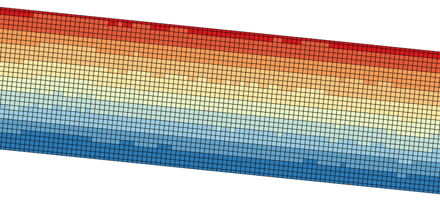

# qzeb3d
calculating 3D-point-clouds from Georawfiles/Georohdaten of german ZEB

## Goal of the project
This application creates a 3D-point-cloud from given Georawfiles/Georohdaten.
The aim of this project was to create a tool, which extracts all information about the surface of roads and transform them into a file format that can be handled by GIS and 3D-software (e.g. Cloud Compare).
At this version of the software, TP1a and TP1b are mandatory to create the point cloud. TP3 can be imported too, but is not used furthermore.
The software connects the longitudinal profile with one laser on the cross-beam/transverse profile. The height of the HMP will be the base for all points in the point cloud, i.e. the HMP will be stretched to the whole width of the transverse profile. Each point of the HMP will be connected to one cross profile (1:n relationship) and each point on the cross profiles will be added by the corresponding HMP-value. The information about the absolute height will be ignored (this improves the comparison of difference tracks).
The CRS of the resulting point cloud is EPSG:4326 (WGS84).

## Preliminary remark
This project uses the Qt-framework **5.7**. It is not tested against other Qt-versions.
The software is available under the terms of the GPL v3, so feel free to use (and improve ^^) the tool.
A first internationalisation of the GUI is realised for the following languages: english, french, german, polish.

## Usage
Just download the project and open the PRO-file with Qt-Creator.

### Run the project
If you run the project, maybe you get a warning message that the settings-file cannot be found. The software searches in a directory beneath the executable for this file. The settings-file is not a ressource-file, i.e. Qt will not copy the file during the build-job of the application. If you run the app from IDE (e.g. QtCreator), than comment and uncomment the following lines in *Utilities/settings.cpp* to load the settings correctly:
```c++
//store pah to settings file with QT-separators
this->settingsPath = QDir::fromNativeSeparators(QApplication::applicationDirPath()) + "/Settings/mainsettings.ini";
this->settingsPath = QDir::toNativeSeparators(this->settingsPath);

//hard coded Unix-path for testing
//this->settingsPath = "/Users/Christoph/GitHub/qzeb3d/Settings/mainsettings.ini";
```

### Build the application
If you build the application, remember to remove the hard coded path to the settings-file if necessary.
After building the application, copy the settings-file to the right directory of the application. If there is no settings-file at application-launch, a new file will be created by the software and the language of the GUI will be english.

## Annotations to the calculation
The connection between longitudinal and transverse profile is realised by the number of the laser at cross-beam, where the HMP can be found. This number is hard-coded in *mainwindow.cpp*:
```c++
//create a pointcloud from the given zeb-track
controller.convertZebToPointCloud(controller.getDataName(filename, "zeb"), ui->progressBar, 5, this->ui->textEdit);

```
In the code-example, the number 5 is the number of the laser on the cross-beam, where the HMP can be found. For more information, see the documentation of the function *convertZebToPointCloud* in *controller.cpp*:
```c++
/*!
 * \brief Controller::convertZebToPointCloud
 * This function converts an imported ZEB-track into a 3D-pointcloud.
 * \param trackNumber number of the track as QString for identifying the track
 * \param pb the progressbar from the gui
 * \param indexSensorHmp the integer of the transverse beam crossing the HMP, starting by one at the right side in driving direction
 * \return 0 in every cases (no additional error handling implemented yet)
 */
int Controller::convertZebToPointCloud(QString trackNumber, QProgressBar *pb, int indexSensorHmp, QTextEdit *te) {...}
```

## Further usage of the point cloud
The resulting CSV-file contains a header line. The definition of the different columns are the following:
1. x ... longitude of the current point
2. y ... latitude of the current point
3. z ... height as the sum of HMP and cross profile of the current point
4. indexCrossProfile ... the number of the cross profile, which corresponds to the current point
5. indexHmp ... the number of the HMP-value, which corresponds to the current point
6. indexCrossSensor ... the index of the sensor on the cross beam, which corresponds to the current point

The result file can be imported by e.g. Cloud Compare or QGIS. In a GIS, the information about the height can be used for colouring the points (red = high height-values, blue = low height-values):
<p align="center">


</p>

To get a regionalisation of the point data, Voronoi-polygons can be used. Because of the equidistance between the points in and crossing driving direction, the Voronoi-polygons are rectangles (red = high height-values, blue = low height-values):
<p align="center">


</p>

A regionalisation with (Delaunay-)triangulation or a rasterization should be possible, but is not tested.

## Known issues
1. If the distance between two following coordinates is not exactly the same as described in the XML-files, then points at the end/beginning at one data-section (XML-node *Datenstrom*) can be not correctly arranged:

2. The distance between two following sensors in the cross beam is to big, i.e. I used a TP1b-file with 10cm distance between each laser on the cross beam. The resulting distance in the point cloud was ca. 15cm. I had not found the problem, maybe it is a problem with the CRS (10cm distance between two points in EPSG:4326 is just detecting by using a high precision of double values - maybe a rounding problem occured).
3. The software was created and tested using macOS 10.12., not Windwos either Linux is tested until now.
4. The position of crossing transversal and longitudinal profile on the cross beam is hard coded. There is no input option in the GUI.
5. If you import a measurement with a trajectory, that can be described by the linear equation x=a, i.e. driven directly from north to south or otherwise, than it could be possible, that the points of the cross profile are on the wrong side. This problem is possible because of the mathematical model of the application, but not tested and not seen until now.
6. Huge RAM-usage (1km track needs ca. 800MB RAM). The whole point cloud will be created in the RAM and displayed at the end of the calcualtions. It is not recommended to import more than one track into one session.
7. No Optimisation realised for zooming and paning in the 3D-view of the software, i.e. it is not smooth if you loaded long tracks into the application.
8. The calculation of distances in driving directions are realised in 2D. I think 3D-distances should be correctly because the software created a 3D-point-cloud. But the height should be ignorable for point on the road with a distance of 10cm. The usage of a 3D-distances created very unrealistic point cloud, so it is recommended to use the 2D-distance.
9. The software is just tested with 10cm equidistance in TP1a and TP1b (distance between 2 following sensors on the cross beam). It is possible, that the software has problems with other settings of Georawfiles (but I hope it can handle them too - maybe somebody is testing it ^^).
